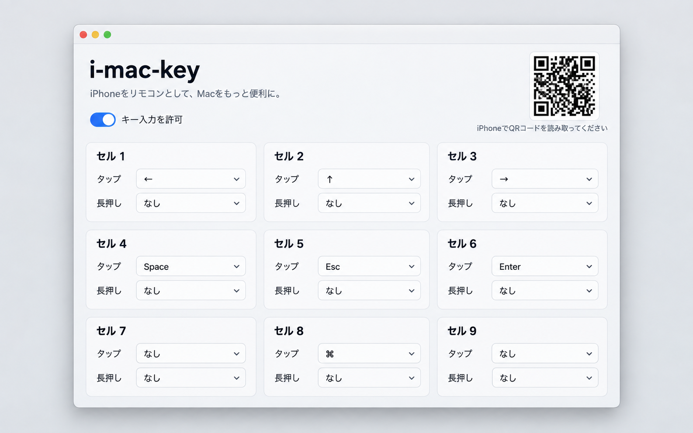

# i-mac-key

iPhoneをMacのリモコンやボタンとして使うためのmacOSアプリです。

Macの前から少し離れた場所にいても、手元のiPhoneからMacのGUIを操作できます。たとえば、プレゼン中のスライド送り、写真や資料の切り替え、動画の再生・停止など、キーボードで操作できることをiPhoneから実行できます。

iPhone側はブラウザで開くため、専用アプリのインストールは不要です。MacとiPhoneが同じローカルネットワークに接続されていれば使えます。



_上図は機能説明用のUIモックです。実際の画面はOSの表示設定によって異なります。_

## できること

- iPhoneを、Mac用の手元のリモコンとして使う
- 9つのボタンに任意のキー入力を割り当てる
- ボタンのタップと長押し（0.5秒）に、それぞれ操作を設定する
- プレゼンのスライド送りや、写真・資料の前後移動を操作する
- 再生・停止など、キーボードショートカットで操作できるGUIを手元から操作する

## インストール

GitHub Releasesから最新のZIPを取得し、展開します。

```sh
mkdir -p "$HOME/Applications"
curl -fL --retry 3 https://github.com/azu/i-mac-key/releases/latest/download/i-mac-key.zip -o /tmp/i-mac-key.zip
curl -fL --retry 3 https://github.com/azu/i-mac-key/releases/latest/download/SHA256SUMS.txt -o /tmp/i-mac-key-SHA256SUMS.txt
(cd /tmp && shasum -a 256 -c i-mac-key-SHA256SUMS.txt)
unzip -q /tmp/i-mac-key.zip -d "$HOME/Applications"
xattr -dr com.apple.quarantine "$HOME/Applications/i-mac-key.app"
open "$HOME/Applications/i-mac-key.app"
```

現時点のリリース版はDeveloper ID署名・Apple公証をしていません。`xattr`はダウンロードしたアプリの隔離属性を外す操作なので、上記の公式リリースとチェックサムを確認できた場合だけ実行してください。macOSは未署名・未公証ソフトウェアの実行を警告またはブロックすることがあります。詳しくは[Appleの安全なアプリの開き方](https://support.apple.com/en-gb/102445)を参照してください。

## 使い方

1. アプリを起動します。開発中は、Xcodeで`Package.swift`を開くか、ターミナルで`swift run --disable-sandbox`を実行します。
2. Macアプリの「キー入力を許可」を押し、macOSの「システム設定 > プライバシーとセキュリティ > アクセシビリティ」で許可します。
3. iPhoneをMacと同じWi-Fiに接続し、Macに表示されたQRコードをカメラで読み取ります。
4. iPhoneのブラウザに表示された9つのボタンを、Macのリモコンとして使います。
5. 必要に応じて、各ボタンのタップ・長押し（0.5秒）に送るキーを設定します。

初期設定では、中央左が`←`、中央右が`→`です。設定はMacのユーザー設定として保存されます。

## セキュリティと制約

- リモコンのURLには起動ごとに変わる接続トークンを含めます。URLを知らない端末は操作できません。
- 通信は同一ローカルネットワークで完結します。外部サーバーやiPhoneアプリは使いません。
- キー入力にはmacOSのアクセシビリティ権限が必要です。
- リリースZIPはタグ`v*`をpushするとGitHub Actionsで作成されます。現時点ではDeveloper ID署名・Apple公証はしていません。

## 検証

```sh
task_cache="$(mktemp -d /private/tmp/i-mac-key-build.XXXXXX)"
CLANG_MODULE_CACHE_PATH="$task_cache" SWIFTPM_MODULECACHE_OVERRIDE="$task_cache" swift build --disable-sandbox
```

リリース用ZIPは次で作成できます。

```sh
scripts/package-release.sh
```
